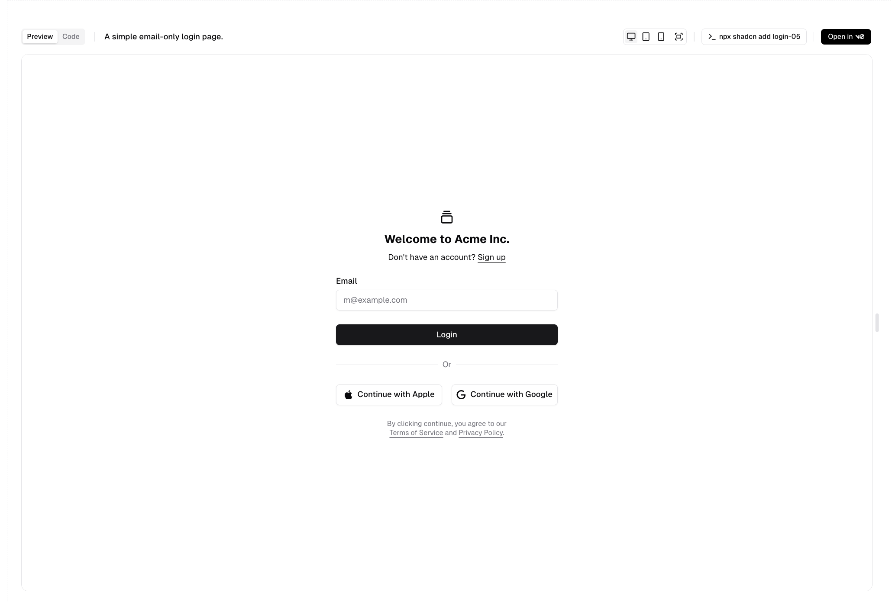

# 인증화면

## 인증 UI

- [shdcn-authentication-ui]https://ui.shadcn.com/blocks/authentication)
- 5가지 UI 중 한 가지 선택 (5번쨰 UI로 선택)
- 


## 인증 UI에 포함되어야 하는 기능

1. 로그인은 이메일과 비밀번호를 입력받는다.
2. 비밀번호 찾기 기능이 있다.
3. SNS 로그인 연동이 된다.
4. 회원가입 기능이 있다.
5. 개인정보동의와 약관 정보를 확인 할 수 있다.
6. 회원가입시 First Name 과 Last Name을 분리하여 수집한다.


### 유효성 검사

- 이메일, 비밀번호는 유효성 검사를 한다.
- 이메일은 "@" 와 ".com" 이 필수로 포함된다.
- 비밀번호는 최소 8자 최대 20자 이다.
- 특수문자, 영문대, 영문소, 숫자를 필수로 포함해야한다.
- 이메일과 같은 글자 배열이 연속으로 4자 이상 나올 수 없다.
- 인증을 통과하지 못했을 경우 안내 텍스트가 나오고, 인증을 진행하지 않는다.

### 로그인 정책

- 이메일 확인 정책

  - 유효성 검사를 통과하지 못한 이메일로 로그인 시도할 경우, "이메일을 올바르게 입력해주세요."
  - 등록되지 않은 이메일로 로그인 시도할 경우, "해당 이메일은 등록되어 있지 않습니다." 메시지 표시
  - 비활성화된 계정의 경우 "해당 계정은 비활성화되었습니다." 메시지 표시

- 비밀번호 오류 정책

  - 로그인 실패 3회 이상 시 "비밀번호 찾기를 이용해주세요." 추가 안내
  - ~~연속된 로그인 실패 횟수 제한 (예: 5회 실패 시 일정 시간 로그인 제한)~~
  - 실패 시 "비밀번호가 일치하지 않습니다." 메시지 표시

  - 세션 및 보안 정책

- JWT, OAuth 등의 인증 방식 선택 및 적용
  - 자동 로그아웃 (예: 30분 이상 활동이 없을 경우 로그아웃)
  - 다중 로그인 허용 여부 결정 (예: 한 계정으로 여러 기기에서 동시 로그인 가능 여부)

## SNS 로그인 연동 정책

- OAuth를 사용한 SNS 로그인 (Google, Facebook, Apple 등)
- 기존 이메일 계정과 SNS 계정 연결 여부 설정 (동일 이메일일 경우 자동 연동 or 수동 선택)

## 비밀번호 찾기 정책

- 비밀번호 찾기 시 본인 확인을 위한 이메일 인증
- 인증 완료 후 새 비밀번호 설정 페이지 제공
- 새 비밀번호 설정 시 기존 비밀번호와 동일하지 않도록 유효성 검사
- 인증 메일 발송 후 10분 이내 사용 가능하도록 제한

## 회원가입 정책

- 이메일 중복 확인 (이미 가입된 이메일인지 체크)
- 비밀번호 2회 입력 확인 (비밀번호, 비밀번호 확인 입력란)
- 닉네임이나 아이디가 필요할 경우 중복 확인
- 회원가입 시 이메일 인증 완료 후 가입 확정
- 약관 및 개인정보 동의 사항 상세화
- 필수 동의: 이용약관, 개인정보처리방침
- 선택 동의: 광고성 정보 수신 동의 (이메일, SMS 등)


## 2차 인증(선택 가능) -> 추후 진행

- ~~로그인 시 OTP(One-Time Password) 옵션 제공~~
- ~~Google Authenticator 또는 이메일 인증 코드 방식 선택 가능~~
- ~~새 기기에서 로그인할 경우 추가 인증 요청~~


## 기타 보안 관련 정책

- 비밀번호 변경 주기 설정 (예: 6개월마다 비밀번호 변경 권장)
- 계정 잠금 정책 (일정 횟수 이상 로그인 실패 시 계정 잠금 및 이메일 알림 발송)
- ~~로그 기록 확인 기능 (최근 로그인 기록, 로그인한 IP 주소 조회) -> 데이터수집 따로 만들기~~
- 회원 탈퇴 기능 (탈퇴 시 계정 복구 가능 기간 설정 여부 고려)

---

## (FE) 유효성 검사 라이브러리


### react-hook-form + zod

- react-hook-form: 성능이 뛰어나고 최소한의 리렌더링으로 효율적
- zod: 타입 안전성과 스키마 기반 검증을 지원
- 조합: react-hook-form + @hookform/resolvers + zod
- [react-hook-form](https://www.react-hook-form.com/)
- [zod](https://zod.dev/)

```
import { useForm } from "react-hook-form";
import { zodResolver } from "@hookform/resolvers/zod";
import { z } from "zod";

const schema = z.object({
  email: z.string().email({ message: "이메일을 올바르게 입력해주세요." }),
  password: z.string()
    .min(8, "비밀번호는 최소 8자 이상이어야 합니다.")
    .max(20, "비밀번호는 최대 20자까지 가능합니다.")
    .regex(/[A-Z]/, "비밀번호에 최소 1개의 대문자가 포함되어야 합니다.")
    .regex(/[a-z]/, "비밀번호에 최소 1개의 소문자가 포함되어야 합니다.")
    .regex(/[0-9]/, "비밀번호에 최소 1개의 숫자가 포함되어야 합니다.")
    .regex(/[\W_]/, "비밀번호에 최소 1개의 특수문자가 포함되어야 합니다."),
});

export default function LoginForm() {
  const { register, handleSubmit, formState: { errors } } = useForm({
    resolver: zodResolver(schema),
  });

  const onSubmit = (data) => console.log(data);

  return (
    <form onSubmit={handleSubmit(onSubmit)}>
      <input {...register("email")} placeholder="이메일" />
      {errors.email && <p>{errors.email.message}</p>}

      <input type="password" {...register("password")} placeholder="비밀번호" />
      {errors.password && <p>{errors.password.message}</p>}

      <button type="submit">로그인</button>
    </form>
  );
}

```
